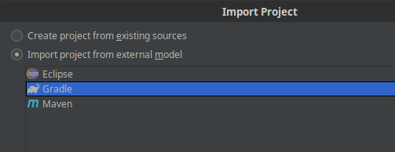
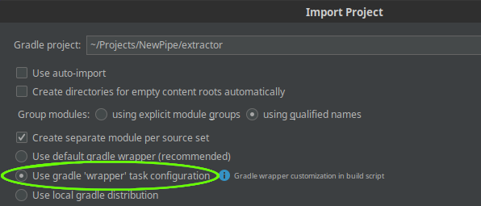
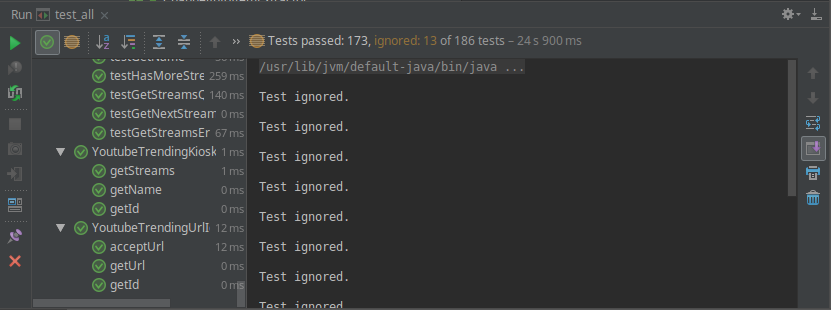

# Before You Start

These documents will guide you through the process of creating your own Extractor
service of which will enable NewPipe to access additional streaming services, such as the currently supported YouTube and SoundCloud.
The whole documentation consists of this page, which explains the general concept of the NewPipeExtractor, as well as our
[Jdoc](https://teamnewpipe.github.io/NewPipeExtractor/javadoc/) setup.

__IMPORTANT!!!__ This is likely to be the worst documentation you have ever read, so do not hesitate to
[report](https://github.com/teamnewpipe/documentation/issues) if
you find any spelling errors, incomplete parts or you simply don't understand something. We are an open community
and are open for everyone to help :)

## Setting Up Your Dev Environment

First and foremost, you need to meet the following conditions in order to write your own service.

### What You Need to Know:

- A basic understanding of __[git](https://try.github.io)__
- Good __[Java](https://whatpixel.com/best-java-books/)__ knowledge
- A good understanding of __[web technology](https://www.w3schools.com/)__
- A basic understanding of __[unit testing](https://www.vogella.com/tutorials/JUnit/article.html)__ and __[JUnit](https://junit.org/)__
- A thorough understanding of how to [contribute](https://github.com/TeamNewPipe/NewPipe/blob/dev/.github/CONTRIBUTING.md#code-contribution) to the __NewPipe project__

### Tools/Programs You Will Need:

- A dev environment/ide that supports:
    - __[git](https://git-scm.com/downloads/guis)__
    - __[Java 8](https://www.java.com/en/download/faq/java8.xml)__
    - __[Gradle](https://gradle.org/)__
    - __[Unit testing](https://junit.org/junit5/)__
    - [IDEA Community](https://www.jetbrains.com/idea/) (Strongly recommended, but not required)
- A __[Github](https://github.com/)__ account
- A lot of patience and excitement ;D

After making sure all these conditions are provided, fork the [NewPipeExtractor](https://github.com/TeamNewPipe/NewPipeExtractor)
using the [fork button](https://github.com/TeamNewPipe/NewPipeExtractor#fork-destination-box).
This is so you have a personal repository to develop on. Next, clone this repository into your local folder in which you want to work in.
Then, import the cloned project into your [IDE](https://www.jetbrains.com/help/idea/configuring-projects.html#importing-project)
and [run it.](https://www.jetbrains.com/help/idea/performing-tests.html)
If all the checks are green, you did everything right! You can proceed to the next chapter.

### Importing the NewPipe Extractor in IntelliJ IDEA
If you use IntelliJ IDEA, you should know the easy way of importing the NewPipe extractor. If you don't, here's how to do it:

1. `git clone` the extractor onto your computer locally.
2. Start IntelliJ Idea and click `Import Project`.
3. Select the root directory of the NewPipe Extractor
4. Select "__Import Project form external Model__" and then choose __Gradle__.

5. In the next window, select "__Use gradle 'wrapper' task configuration__".

### Running "test" in Android Studio/IntelliJ IDEA

Go to _Run_ > _Edit Configurations_ > _Add New Configuration_ and select "Gradle".
As Gradle Project, select NewPipeExtractor. As a task, add "test". Now save and you should be able to run.

# Inclusion Criteria for Services

After creating you own service, you will need to submit it to our [NewPipeExtractor](https://github.com/teamnewpipe/newpipeextractor)
 repository. However, in order to include your changes, you need to follow these rules:

1. Stick to our [Code contribution guidelines](https://github.com/TeamNewPipe/NewPipe/blob/dev/.github/CONTRIBUTING.md#code-contribution)
2. Do not send services that present content we [don't allow](#content-that-is-not-permitted) on NewPipe.
3. You must be willing to maintain your service after submission.
4. Be patient and make the requested changes when one of our maintainers rejects your code.

## Content That is Permitted:

- Any content that is not in the [list of prohibited content](#content-that-is-not-permitted).
- Any kind of pornography or NSFW content that does not violate US law.
- Advertising, which may need to be approved beforehand.

## Content That is NOT Permitted:

- Content that is considered NSFL (Not Safe For Life)
- Content that is prohibited by US federal law (Sexualization of minors, etc).
- Copyrighted media, without the consent of the copyright holder/publisher.

