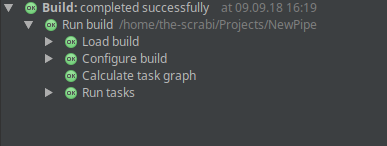

# Run the changes in the App

You should develop and test your changes with the JUnit environment that is
provided by the NewPipe Extractor and IDEA. If you want to try it then with
the actual fronted you need to follow these steps.

### Setup Android Studio

First of all you want to setup a working Android Studio environment. For this please
download Studio from [developer.android.com](https://developer.android.com/studio/),
and follow the [instructions](https://developer.android.com/studio/install) about how to set it up.

### Get the NewPipe code and run it.

In order to get it you must simply clone or download from the current `dev` branch
[github.com/TeamNewPipe/NewPipe.git](https://github.com/TeamNewPipe/NewPipe/archive/dev.zip).
You can then build and run it following [these instructions](https://developer.android.com/studio/run/).
Please also make sure you are comfortable with [adb](https://en.droidwiki.org/wiki/Android_Debug_Bridge) since
you might experience some trouble running your compiled app on a real device, especially under linux where you
sometimes have to adjust the udev rules in order to
[make your device be accessible](https://www.janosgyerik.com/adding-udev-rules-for-usb-debugging-android-devices/).

### Run your changes on the Extractor

In order to use the extractor in our app we use [jitpack](https://jitpack.io). This is a build service that can build
maven *.jar packages for android and java based on a github or gitlab repositories. 

To the extractor through jitpack, you need to push them to your online repository of
your copy that you host either on [github](https://github.com) or [gitlab](https://gitlab.com). It's important to host
it on one of both. Now copy your repository url in Http format, go to [jitpack](https://jitpack.io/), and past it there.
From here you can grab the latest commit via `GET IT` button.
I recomend not to use SNAPSHOT, since I am not sure when snapshot is build. An "implementation" string will be generated
for you. Copy this string and replace the `implementation 'com.github.TeamNewPipe:NewPipeExtractor:<commit>'` line in
the file [/app/build.gradle](https://github.com/TeamNewPipe/NewPipe/blob/dev/app/build.gradle#L58) with it.

<video width="600" controls>
  <source src="../media/how_to_jitpack.mp4" type="video/mp4">
Your browser does not support the video tag.
</video>

If everything synced well then you should only see a screen with OK signs. Now you can go on an compile and run NewPipe
with the new extractor.

### Troubleshooting

If something went wrong on jitpack site, you can check their build log, by selecting the commit you tried to build and
click on that little paper symbol next to the `GET IT` button. If it is red it already shows that the build failed.

