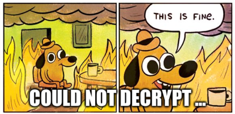

# Releasing a new NewPipe version

This site is ment for those who want to maintain NewPipe, or just want to know how releasing work.

## Difference between regular and hotfix release

NewPipe is a web crawler. That means it does not use a web API, but instead tries to scrape the data from the website,
this however has the disadvantage of the app to brake instantly when Youtube changes something.
We can not know when this happen therefore we need to be prepared when it happens, and at lease reduce our downtime as
god as possible. Our whole release cycle is therefore designed around this issue.

So there is a difference between a release that is meant to introduce new features or fix minor bugs,
and a version that fixes an issue that occurred because Youtube (or some other service) suddenly changed their website (mostly call this a shutdown).
Lets first have a look how a regular release work, and then how the hotfix release work.

## Regular releases

Regular releases are normal releases like they are done like in any other app. Releases are always stored on __master__ branch. By means the latest commit on
__master__ is always equal to the current releases. No development is done on master. This ensures that we always have one
branch with a stable/releasable version.

### Feature branching
For development the __dev__ branch is used. Pushing to __dev__ directly however is also not allowed since QA and testing should be done before pushing to __dev__.
This ensures that also the dev version works as good a possible.
So in order to change something on the app one may want to __fork__ the dev branch and develop the changes in his own branch (this is called feature branching).

### Merching features/bugfixes

After being done with the feature one should open up a __Pull Reuqest__ to the dev branch here a maintainer can do __Code review__ and __Quality Assurance (QA)__.
If you are a maintainer please take care about the code architecture so corrosion or code shifting can be prevented. Please also preface core quality over functionality.
So in short: cool function but bad code -> no merge. We should focus on leaving the code as clean as possible.

At best you as a maintainer should build the app and put the signed apk into the description of that new Pullrequest. This way other people can test the feature/bugfix and therefore help with QA.

### Creating a new release

### Releasing

## Hotfix releases

### Fix branch

### Releasing
