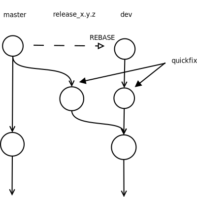

# Releasing a new NewPipe version

This site is ment for those who want to maintain NewPipe, or just want to know how releasing work.

## Difference between regular and hotfix release

NewPipe is a web crawler. That means it does not use a web API, but instead tries to scrape the data from the website,
this however has the disadvantage of the app to brake instantly when Youtube changes something.
We can not know when this happen therefore we need to be prepared when it happens, and at lease reduce our downtime as
god as possible. Our whole release cycle is therefore designed around this issue.

So there is a difference between a release that is meant to introduce new features or fix minor bugs,
and a version that fixes an issue that occurred because Youtube (or some other service) suddenly changed their website (mostly call this a shutdown).
Lets first have a look how a regular release work, and then how the hotfix release work.

## Regular releases

Regular releases are normal releases like they are done like in any other app. Releases are always stored on __master__ branch. By means the latest commit on
__master__ is always equal to the current releases. No development is done on master. This ensures that we always have one
branch with a stable/releasable version.

### Feature branching
For development the __dev__ branch is used. Pushing to __dev__ directly however is also not allowed since QA and testing should be done before pushing to __dev__.
This ensures that also the dev version works as good a possible.
So in order to change something on the app one may want to __fork__ the dev branch and develop the changes in his own branch (this is called feature branching).

### Merging features/bugfixes

After being done with the feature one should open up a __Pull Reuqest__ to the dev branch here a maintainer can do __Code review__ and __Quality Assurance (QA)__.
If you are a maintainer please take care about the code architecture so corrosion or code shifting can be prevented. Please also preface core quality over functionality.
So in short: cool function but bad code -> no merge. We should focus on leaving the code as clean as possible.

At best you as a maintainer should build the app and put the signed apk into the description of that new pullrequest. This way other people can test the feature/bugfix and therefore help with QA.

After the maintainer merged the new feature into the dev branch he should add the title of the pullrequest or a summary of the changes into the [release note](#release-notes).

### Creating a new release

Once there are enough features together, and the maintainer feels like releasing he should create a new release. Here is a list of things he will want to do then.
Be aware of the rule that a release should never be done on a frieday. For NewPipe this mean don't do a release if you don't have time for it!!!

1. Fork the __dev__ branch into a new __release_x.y.z__ branch.
2. Increase the [version number](#versioning)
3. Copy the [release note](#release-notes) from the github version draft into the corresponding fastlane file (see [release note](#release-notes)).
4. Open up a pullrequest form the new __release_x.y.z__ branch into the __master__ branch.
5. Create an Issue pointing to the new Pullrequest. The reason for opening an issue is that from my perception more people are reading issues then they read pullrequests. Put the release-note into this pull request.
6. Build a signed release version of NewPipe using schabis signing keys. This is a release candidate (RC). Name the build apk file `NewPipe_<versionNumber>_RC1.apk`.
   Zip it and post it into the head of the release issue. This way other people can test the release candidate.
7. Test and QA the new version with the help of other people
8. Leave the PR open for a few days and advertise people to help testing.

While being in release phase no new pullrequests must be merged into __dev__ branch.

This procedure does not have to be done for the extractor as extractor will be tested together with the fronted.

### Quckfixes

When issuing a new release you will most likely encounter new bugs. These bugs are called __regressions__ as they where not there before.
If you notice a regression during release phase you are allowed to push fixes directly into the release branch without having to fork a branch away from it.
All maintainers (people who have write access to the release branch) have to be aware that they might be required to fix regressions so plan your release on a time when
you have time for coding. Do not introduce new features while being in release phase.

When you have pushed a quickfix you will want to updated the __release candidate__ you put into the __issue__ corresponding to the __release pull request__.
Increase the version number in the filename of the Release candidate. e.g. `NewPipe_<versionNumber>_RC2.apk` etc. _Don't update the actuall version number however :P_.

### Releasing

Once the glories day of all days has come, and you feel like fulfilling the ceremony of releasing. This is what you will want to do.
After going through the release procedure of having [created a new release](#create_a_new_release) and maybe having done [quickfixes](#quickfixes) on the new release,
you will want to do these steps:

1. Hit merge Pullreqest
2. Create a GPG signed tag with the name `v0.x.y`
3. Merge __dev__ into master on the extractor
4. Create a GPG signed tag with the name `v0.x.y` on the extractor
5. Make sure the draft name equals the tag name 
6. Make sure to not have forgotten enything
7. Hit `Publish Release`
8. Rebase quickfix changes back into __dev__ if quickfixes where made

## Hotfix releases

### Fix branch

### Releasing

## Versioning

Versioning NewPipe is simple.

- __Major__: The __major__ version number (the number before the first dot) was 0 for years. The reason for this changed over time. First I wanted this number to
  switch to 1 once NewPipe was feature complete. Now I rather think of increasing this number to 1 once we can ensure that NewPipe runs stable (part of which this documentation should help). After this (2 and beyond) well god knows what happens if we ever reach 1 ¯\\\_(ツ)\_/¯ .
- __Minor__: The __minor__ version number (the number after the first dot) will be increased if there is a major feature added to the app.
- __Small Minor__: The small minor (the number after the second dot) will be increased if there are just smaller bug fixes or features added to the app.

#### Versioning the extractor

The extractor is always released together with the app, therefore the version number of the extractor is the same as the one of the app.

#### Version code
In android an app can also have a [versionCode](https://developer.android.com/studio/publish/versioning). This code is a `long integer` and can be increased by any value to show a device that a new version is there.
For NewPipe the version code will be increased by 10 regardless of the change of the major or minor version number. The version codes between the 10 steps
are reserved for our internal fdroid build server.

## Release notes
Release notes should give the user an idea of what was changed on the app. The release nodes for NewPipe are stored in the [github draft for a new release](https://github.com/TeamNewPipe/NewPipe/releases/tag/v0.14.0). When a maintainer wants to add change to the release note, but there is no draft for a new version he should create one.

Changes can be categorized into three types.

- __New__: New features that god added to the app.
- __Improved__: Improvements to the app, or already existing features
- __Fixes__: Bugfixes

When releasing a new version of NewPipe, before actually hitting release the maintainer should copy the release note from the draft and put it into a file called
`<versionCode>.txt` (whereas `<versionCode>` needs to be the version code of the comming release). This file must be stored in the direcotry [`/fastlane/metadata/android/en-US/changelogs`](https://github.com/teamnewpipe/newpipe/tree/dev/fastlane/metadata/android/en-US/changelogs). This way fdroid will later be able to show the
changes done on the app.
